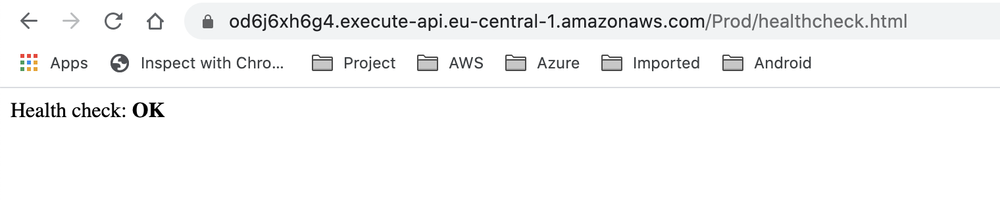

# AWS Serverless springboot API
This project consists of a Java Spring boot application utilizing the power of AWS SAM(Serverless Application Model), which accepts an input as a String request , for example ("Google", "Oracle", "Microsoft", "Amazon", "Deloitte") and append (© with the strings)for those sending back the response to the API request from AWS.

## How to Test the existing hosted API?
### Exposed API
#### 1) `https://<base-uri>/Prod/input/replace` : This is a post call for the functionality of the application
Body (Json): 
```
{
    "userInput": "We really like the new security features of Amazon"
}
```

*For Reference*: Sample request from Postman:


- Example input: 	“We really like the new security features of Amazon Web Service”. 

- Expected output: “We really like the new security features of Amazon Web Service©”.

#### 2) `https://<base-uri>/Prod/healthcheck.html`: This is a get call for checking the health of the API service
Expected output: Health check: OK



---
**Note:**
Replace the <base-uri> : od6j6xh6g4.execute-api.eu-central-1.amazonaws.com
---

## Design Consideration

Here I will describe the design decision taken into consideration for hosting the API in AWS along with CICD implementation.

### High level Design Diagram


#### Serverless Application Model(SAM)
    I have choosen [Serverless](https://aws.amazon.com/serverless/sam/) model for the deployment of the service because of following reasons:
    - As its a small web service and doesn't require a complex deployment pattern.
    - This is efficient from Cost perspective since the resources for lambda is only pay what you use(No idle capacity).
    - Integrity security model for code.
    - No overhead of maintaining the servers: reduced operational cost.
    - Flexible scaling.
    - Write less infra-structure-as-code: SAM reduces number of lines of code for infra drastically and does most of the provision with an expanded template in the background. For example:serverless-cloudformation-app.yaml has only 27 lines of code and the exapnded version of same template has 83 lines of code.  
    - This results in less time for implementation which results in fast and cost effective deliverables.

#### AWS Lambda Function:
    - AWS Lambda is a serverless compute service that lets you run the code without provisioning or managing servers, creating workload-aware scaling logic, maintaining event integrations thus managing runtimes on its own.
    - With Lambda, you can run code for virtually any type of application or backend service - all with zero administration.  
    - Lambda reduces the cost of infra drasatically. Since Lambda is event driven, you pay for the compute time consumed, so we never pay for over-provisioned infrastructure.
    - AWS Lambda automatically scales application by running code in response to each event - automated scaling operation.  
    - Optimizes the code execution time by choosing the right memory size for your function 
    - Serves dynamic content of the application example: Data which changes according to the  Business logic

#### AWS API Gateway:
    - Amazon API Gateway is a fully managed service that makes it easy for developers to create, publish, maintain, monitor, and secure APIs at any scale. APIs act as the "front door" for applications to access data, business logic, or functionality from your backend services.
    - Using API Gateway, you can create RESTful APIs and WebSocket APIs that enable real-time two-way communication applications
    - Run multiple versions of the same API simultaneously with API Gateway, allowing you to quickly iterate, test, and release new versions. 
    - Throttle traffic and authorize API calls to ensure that backend operations withstand traffic spikes and backend systems are not unnecessarily called.
    - API Gateway provides a tiered pricing model for API requests. With an API Requests price as low as $0.90 per million requests at the highest tier, you can decrease your costs as your API usage increases per region across your AWS accounts.
            
#### Serverless stack
Serverless Stack includes following AWS services:


    - One API Gateway comprising of RestApi with two endpoints:
        - `/<project-context-part>`
        - `/healthcheck`
    - LambdaRole with the policy attached to use API Gateway
    - UserInput Lambda function.
    - Healthcheck Lambda Function.

### Codebuild(CICD)
AWS [CodeBuild](https://docs.aws.amazon.com/codebuild/latest/userguide/welcome.html) is a fully managed continuous integration service that compiles source code, runs tests, and produces software packages that are ready to deploy. With CodeBuild, you don’t need to provision, manage, and scale your own build servers. The agent is automatically provisioned as container by AWS.

#### CodeBuild Cloudformation stack
This stack includes the following objectives:


    - Creates a S3 bucket which will be used to store the CloudFormation package.
    - buildspec.yml stage in the build part performing activities.
        - Install aws-cli
        - Install maven
        - Maven clean package: This creates the Java package as jar.
        - AWS CodeBuild role to carry CodeBuild operation,
        - AWS CloudFormation package: This will package the CloudFormation stack     expanding the Serverless along with source code as jar and push to S3      bucket created by CodeBuild stack.
        - AWS CloudFormation deploy: This will deploy the stack from an output of    package to deploy the Serverless infra.

#### Simple Storage Service (S3):
    - Amazon Simple Storage Service (Amazon S3) is an object storage service that offers industry-leading scalability, data availability, security, and performance. 
    - Scale your storage resources up and down to meet fluctuating demands, without upfront investments or resource procurement cycles. Amazon S3 is designed for 99.999999999% (11 9’s) 
      of data durability because it automatically creates and stores copies of all S3 objects across multiple systems. 
    - Store your data in Amazon S3 and secure it from unauthorized access with encryption features and access management tools. S3 is the only object storage service that allows you to 
      block public access to all of your objects at the bucket or the account level with S3 Block Public Access. 
    - S3 gives you robust capabilities to manage access, cost, replication, and data protection. 
    - S3 Intelligent-Tiering optimizes storage costs by automatically moving objects between four access tiers when access patterns change. There are two low latency access tiers optimized 
      for frequent and infrequent access to help you save up to 40% on storage costs, and two opt-in archive access tiers designed for asynchronous access with cost savings up to 95% for objects that are rarely accessed. 
 
###  Scalability and Reliability of the solution:
Cloud solution should ideally be build as `build today,serve tomorrow as well` and thus we need to consider the scalability and reliability in the application design. We will discuss certain points for this option which we have considered in the application design as well.
- **Modularity**: Since the consideration is taken to go ahead with Serverless application and thus the application needs to follow a modular structure which can be independent small units and used anywhere.
- **Horizontal Scaling**: Since we are using AWS Lambda function, it has a property by default. The first time you invoke your function, AWS Lambda creates an instance of the function and runs its handler method to process the event. When the function returns a response, it stays active and waits to process additional events. If you invoke the function again while the first event is being processed, Lambda initializes another instance, and the function processes the two events concurrently. As more events come in, Lambda routes them to available instances and creates new instances as needed. When the number of requests decreases, Lambda stops unused instances to free up scaling capacity for other functions.
  This feature of Lambda can be used to do Horizontal scaling and thus provide a scalable and reliable solution.
        
#### Infrastructure as code:
##### Since we are designing the solution on AWS, we would use the native solution as CloudFormation for infrastructure as code.

- **CloudFormation**: [AWS CloudFormation](https://aws.amazon.com/cloudformation/) is a service that helps you model and set up your Amazon Web Services resources so that you can spend less time managing those resources and more time focusing on your applications that run in AWS. You create a template that describes all the AWS resources that you want (like Amazon EC2 instances or Amazon RDS DB instances), and CloudFormation takes care of provisioning and configuring those resources for you. You don't need to individually create and configure AWS resources and figure out what's dependent on what; CloudFormation handles that. The following scenarios demonstrate how CloudFormation can help.
  - Simplify infrastructure management
  - Quickly replicate your infrastructure
  - Easily control and track changes to your infrastructure

## How to deploy and use the project?

### Pre-requisite
- AWS account.
- AWS Cli installed  in local to run codebuild cloudformation template.
- CloudFormation role with the policy attached named file `cf-role-policy.json`.
- Git Account

### Steps to follow

**Step-1**: Clone the repository:
Code Repository:          
```
git clone https://github.com/viplav12/aws-serverless-java-sprintboot-application.git
```
**Step-2**: Push this repo in your git repo (This step is for using GITHUB auth token for deploying codebuild-cloudformation.yaml) 

**Step-3**: Paste your git repo url to codebuild-cloudformation.yaml in "SourceLocation" (line number 10)


**Step-4**: Deploy cloudformation code build `codebuild-cloudformation.yaml` in regions eu-central-1
   - Use all the default values except (GitHubToken).   
     Follow below steps to generate GitHubToken:
        - Generate Personal Access Token (https://github.com/settings/tokens)     
        - Select below shown scope of access token.
        
        
        
        - Copy the generated PAT token 
        - Paste this PAT token in *GitHubToken*
        
        
        
     - If using AWS cli, below command can be used
        ```
            aws cloudformation create-stack --stack-name codebuild-serverless --template-url codebuild-cloudformation.yaml
        ```    
         
**Step-5**: To trigger codebuild and deploy serverless-cloudformation-template.yaml: 
    - Push any small change in your git hub code repo (Trigger is added in AWS CodeBuild) or
    - Manually trigger code build 
    **Notes**: It takes around 3-4 minutes to build code via code build and trigger serverless-cloudformation-template.yaml
    
**Step-6**: Copy the API uri from CloudFormation output
        Test API-1: https://copied-uri/healthcheck.html (get call)
        Test API-2: https://copied-uri/input/replace (post call)
                   Example: Body of post call (json): 
                    ```
                    {
                        "userInput": "We really like the new security features of Amazon Web Service"
                    }
                    ```
                    
### Disaster Recovery
Consideration: If we have registered domain and using AWS Route-53 

This refers to the restore of application in case of any regional failure and depends on Recovery Time Objective - time within which the application needs to be up (RTO) and Recovery Point Object- point from which the backup needs to be restored(RPO).As per the Recovery Time Objective(RTO) to restore the webservice within 30 mins. There are the two scenario which can be considered :

#### Active-Passive Scenario:
Deploy infrastructure in two regions but keep one region inactive with respect to usage.


#### Active-Active Scenario


 
 Reference: 
 [AWS SAM](https://docs.aws.amazon.com/serverless-application-model/latest/developerguide/what-is-sam.html) \
 [AWS Lambda](https://aws.amazon.com/lambda/) \
 [AWS API Gateway](https://aws.amazon.com/api-gateway/) 
 